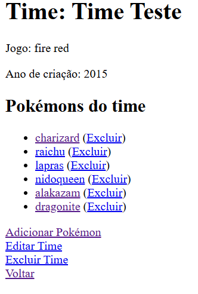
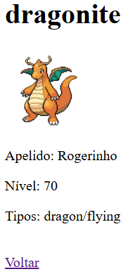

# YourPokeTeam

Um projeto Django usando templates para criar e gerenciar times de Pokémon, baseado nos times que o usuário zerou nos jogos. Utiliza a [PokeAPI](https://pokeapi.co/) para buscar os tipos e imagens dos Pokémons automaticamente.

Projeto feito para o desafio do workshop da fábrica de software.

## Tecnologias utilizadas 💻

- Python 3.11
- Django 5.2
- SQLite (banco padrão do Django)
- Requests (para consumir a PokeAPI)
- HTML (templates do Django)

## Instalação ⚙️

### Passo 1: Certifique-se de que o Git está instalado 

Antes de tudo, verifique se o Git está instalado na sua máquina. Abra o terminal e execute:

```bash
git --version
```

Se você receber uma versão do Git como resposta, está tudo certo! Caso contrário, baixe e instale o Git aqui: [Git Downloads](https://git-scm.com/downloads).

### Passo 2: Clone este repositório 

Ainda no terminal, selecione a pasta onde deseja clonar o repositório e depois execute:

```bash
git clone https://github.com/RenanChacon/wsBackend-Fabrica25.2.git
```

Em seguida entre no repositório clonado executendo:

```bash
cd wsBackend-Fabrica25.2
```

### Passo 3: Crie um ambiente virtual e ative-o

Para não baixar as dependências na sua máquina, crie um ambiente virtual executando:

```bash
python -m venv venv
```

Para ativa-lo no windows execute:

```bash
venv\Scripts\activate
```
Se estiver no macOS ou Linux execute:

```bash
source venv/bin/activate
```

### Passo 4: Instale as dependências

Agora, com a venv ativada, instale as dependências nela executando:

```bash
pip install -r requirements.txt
```

### Passo 5: Crie o banco de dados

Aplique as migrations para criar o banco de dados:

```bash
python manage.py makemigrations
python manage.py migrate
```

### Passo 6: Rode o servidor

Execute:

```bash
python manage.py runserver
```

Depois acesse: http://127.0.0.1:8000/


## Funcionalidades 📝

### Página Inicial

Exibe duas opções:

- Criar novo time de Pokémon

- Listar times existentes

### Criar Time

Formulário para inserir:

- Nome do time
- Nome do jogo
- Ano de criação

Após criar, retorna à página inicial.

### Listar Times

- Se houver times cadastrados, exibe todos como links clicáveis.
- Caso não exista nenhum time, mostra mensagem informando que não há times e botão para voltar.

### Detalhe do Time

Mostra informações do time:

- Nome do time
- Nome do jogo
- Ano de criação
- Lista de Pokémons

Possui opções:

- Editar time
- Excluir time
- Adicionar Pokémon (máximo 6)
- Excluir Pokémon
- Voltar para a lista de times



### Editar Time

Permite alterar:

- Nome do time
- Nome do jogo
- Ano de criação

Salva alterações e volta para a página de detalhe do time.

### Adicionar Pokémon

Formulário para inserir:

- Nome do Pokémon
- Apelido (opcional)
- Nível do Pokémon

O sistema busca automaticamente na PokeAPI:

- Tipo(s) do Pokémon (exemplo: fire/flying)
- Imagem do Pokémon

Após adicionar, volta à página de detalhe do time.

### Detalhe do Pokémon

Mostra informações:

- Imagem
- Apelido (caso tenha)
- Nome 
- Nível
- Tipos

Opção de voltar para o time




### Excluir Time/Pokémon

- Permite remover um time ou Pokémon do banco de dados.
- Redireciona para a página anterior após a exclusão.